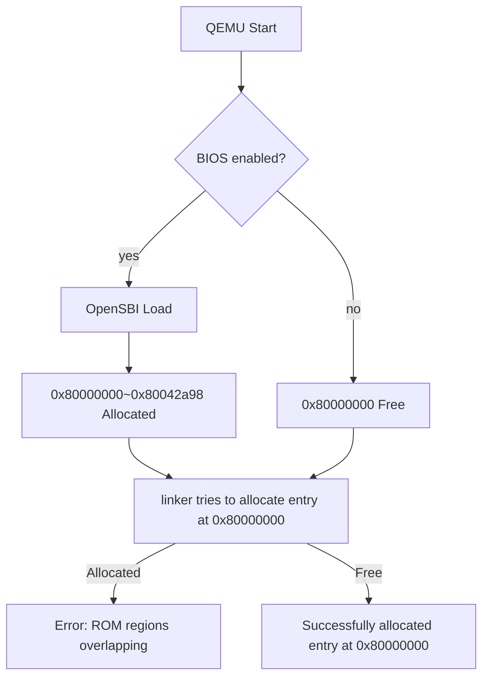

# sion-aarch64 (s64) OSdev
> version 0.0.0 + build 2

## Insight

*2026-06-04*

### Today I Learned
링커 스크립트 기본 문법과 사용법, 핵심 개념, RISC-V 툴체인 명령어

**Linker Script (`kernel/kernel.ld`)**
- Entry point를 `_start`로 지정하고 메모리 레이아웃을 `.text`(0x80000000) → `.data` → `.bss` 순서로 배치
- `-T` 플래그로 `ld`에 전달하여 섹션 배치 제어

**Build Script (`build_kernel.sh`)**
- `riscv64-unknown-elf-as`로 `entry.s`를 `entry.o`로 어셈블
- `riscv64-unknown-elf-ld -T`로 `entry.o`와 `kernel.ld`를 링크하여 `kernel.elf` 생성
- 빌드할 때마다 README의 build 번호 자동 증가

### Today's Key Problem
링커 주소 충돌

#### How to fix?
BIOS를 비활성화하는 간단한 인자 추가:
`-bios none`

## Made by zw.warwick (warwick320)
