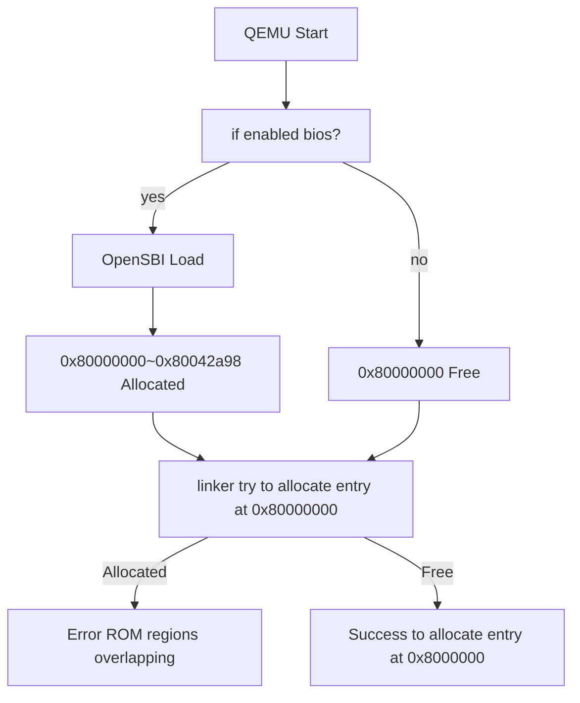

# THIS PROJECT MADE FOR LEARNING ABOUT COMPUTER SYSTEM
> version 0.0.0 + build 2

## Insight

*2026-06-04*

```mermaid
flowchart TD
A[QEMU Start] --> B[if enabled bios?];
B -- yes --> C[OpenSBI Load];
C --> E[0x80000000~0x80042a98 Allocated];
E --> F[linker try to allocate entry at 0x80000000];
B -- no --> D[0x80000000 Free];
D --> F;
F -- Allocated --> G[Error ROM regions overlapping]
F -- Free --> H[Success to allocate entry at 0x8000000]
```

## Made by zw.warwick(warwick320)