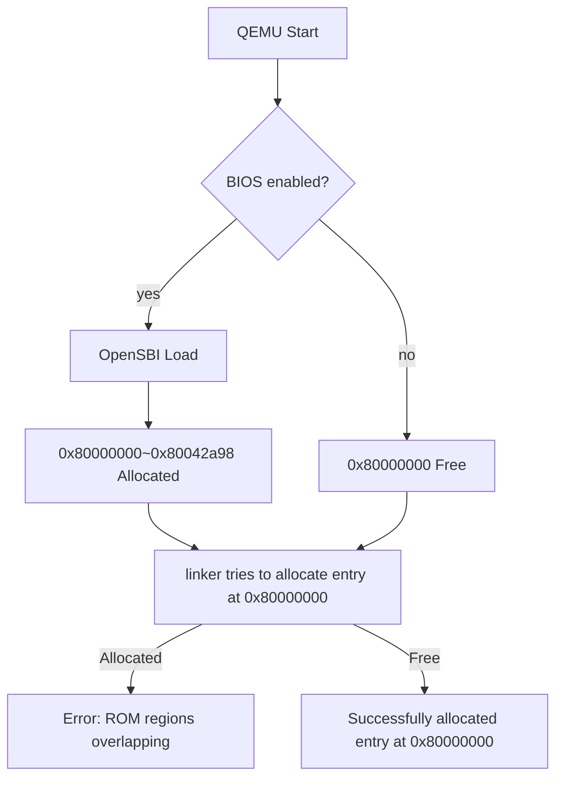

# sion-aarch64 (s64) OSdev
> version 0.0.0 + build 99

## Insight

아오 귀찮아

2026-06-07

### Today I Learned
- CPU의 인터럽트 시스템, 인터럽트 관련 CRS(특수 레지스터)
- 빌트인으로 가변인자 받기
- 메모리맵 I/O , 스택 메모리 관리
- CPP 컴파일러가 레지스터를 처리하는 방식
- CPP 컴파일러의 스택 관리 방식

**인터럽트란?**
> 사실 임베디드의 FreeRTOS 스케쥴링을 경험해 봤다 보니 금방 이해한내용
- 인터럽트란 CPU가 특정 기능을 수행하는 중 갑자기 필요한 기능을 처리할수있게 해주는 기능.
> 이렇게만 들으면 잘 모를수도있겠지만 예를들어 키보드의 키가 눌르면 키 버퍼의 값을 가져와 입력을 처리한다던지,FreeRTOS의 와치독이 커널 패닉을 감시하는 그런느낌 물론 와치독은 좀더 심화 개념
- 코드에서 구현된 발생 부분 `kernel/kernel.cpp`의 `interrupt_handler`

- 발생 조건: mtimecmp에 mtime + 인자로 트리거됨.
- 등록에 필요한 레지스터: `mtvec` 
- 리턴시 꼭 `mret`을 해야함
> 이부분은 뒤에서 서술

**메모리 맵 I/O 이란?**
- 하드웨어랑 연결된 메모리 섹션으로 I/O맵 I/O랑 다르게 메모리의 입력과 출력부분이 메모리의 한부분으로 존재함
- 예를들어 `UART`같은 출력부분 메모리 주소를 역참조하여 값을 올리면 그 값이 바로 터미널에 출력됨

**CPP 컴파일러가 레지스터,스택을 처리하는 방식**
- 

2026-06-04

### Today I Learned
- 링커 스크립트 기본 문법과 사용법, 핵심 개념
- RISC-V 툴체인 명령어

**Linker Script (`kernel/kernel.ld`)**
- Entry point를 `_start`로 지정하고 메모리 레이아웃을 `.text`(0x80000000) → `.data` → `.bss` 순서로 배치
- `-T` 플래그로 `ld`에 전달하여 섹션 배치 제어

**Build Script (`build_kernel.sh`)**
- `riscv64-unknown-elf-as`로 `entry.s`를 `entry.o`로 어셈블
- `riscv64-unknown-elf-ld -T`로 `entry.o`와 `kernel.ld`를 링크하여 `kernel.elf` 생성
- 빌드할 때마다 README의 build 번호 자동 증가

### Today's Key Problem
링커 주소 충돌

#### How to fix?
BIOS를 비활성화하는 간단한 인자 추가:
`-bios none`

## Made by zw.warwick (warwick320)
